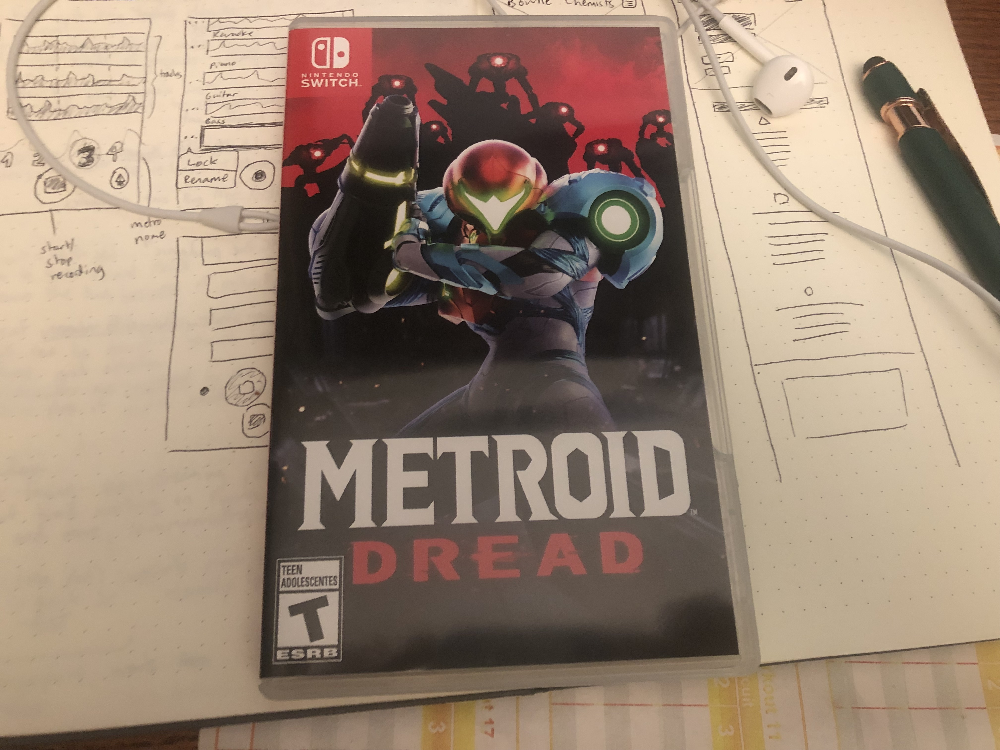
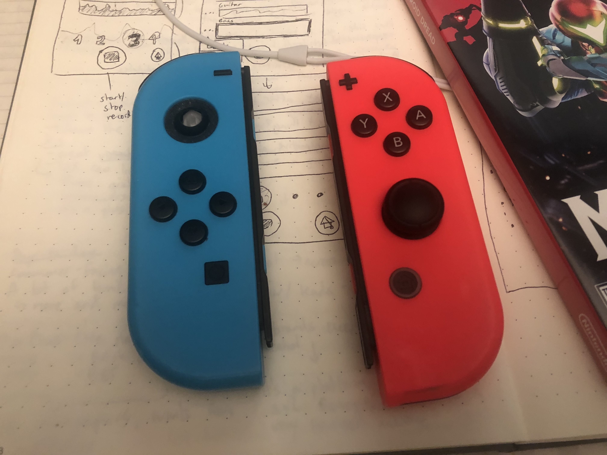
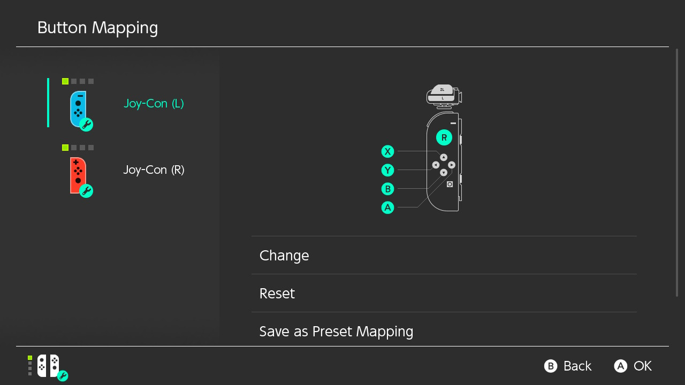

*Preface: I'm not actually* that *upset over being unable to play Dread at the moment, although the following post might sound like I am. I actually find it to be a pretty funny tragicomedy of errors. But regardless, enjoy this dramaticized whine.*

Here's a quick, and lighthearted, update on my experience with *Metroid Dread*: Dreadful.

Not because the game is bad. In fact, the first cutscene and first 2-3 rooms have been nothing but promising so far!

What's causing me gratuitous pain is the fact that my **left Joy-Con is broken, so I can't play the game!!!** (as intended, at least.)

But the salt doesn't end there. I'm not a hardcore Metroid fan, and even after watching early footage, I wasn't convinced from early footage that Dread would be something that would finally pull me in. But that changed after watching some Metroid Fusion gameplay, and hearing several rave reviews that suggested Dread was actually a great experience. So I caved to hype. I preordered the game.

The next morning, I groggily checked my phone and saw the message. My local game store texted me that I could pick up my preorder copy **one day before release**. I almost thought it was a mistake. My hype levels were off the charts!

And then I brought it home, and sadly realized that there was no way I'm playing this game. Not only is my left Joy-Con broken, but it does this weird thing where the control stick is permanently drifting downward. It makes navigating the game (and menus) pure hell.

Desperate, I turned to a recently added Switch feature: full button remapping. I switched movement to the right control stick and swap out the D-pad for the face buttons. But it still feels tremendously weird, and not very pleasant, which doesn't bode well for a game that requires precise interactions.

So my best option now is probably to either shell out $80 for a new set of Joy-Cons (ridiculous, considering their poor build quality) or $70 for a Switch Pro Controller (a pretty lousy price to pay for a console that I predominantly use in handheld mode).

I know that no one reads this blog, but I had to get that off my chest somewhere, anywhere, before I spend what little money is left in my checking account to play this one video game that I splurged on two days ago.

I am so mald.