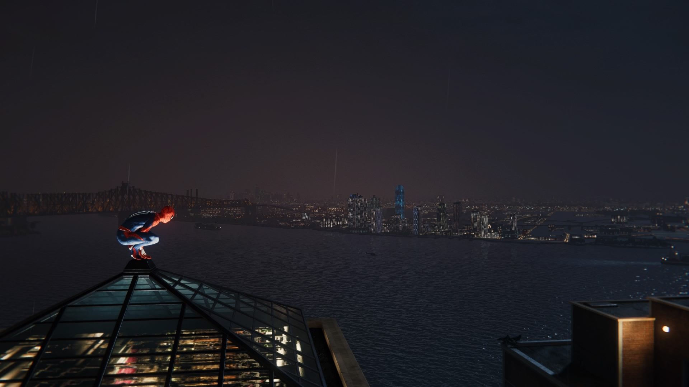
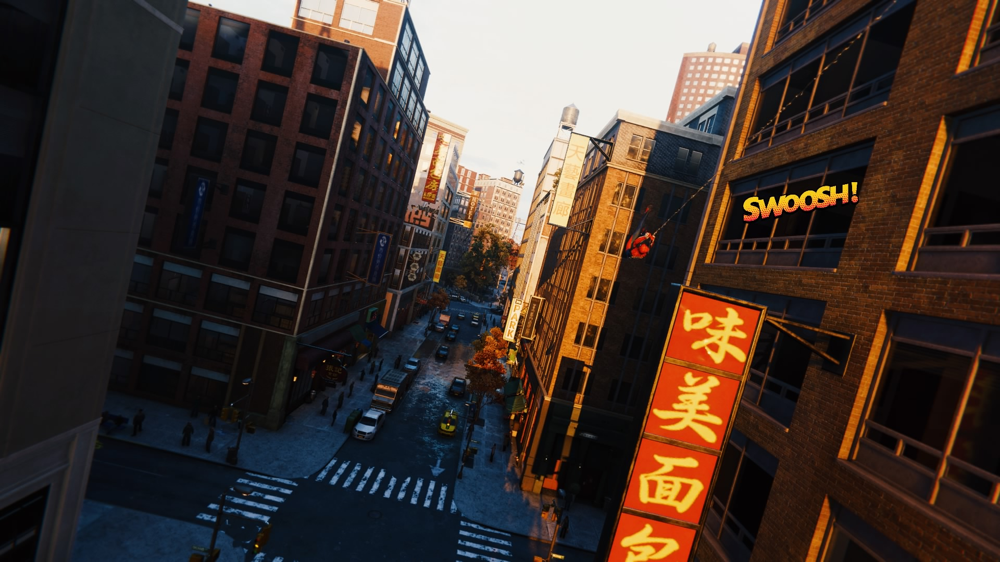
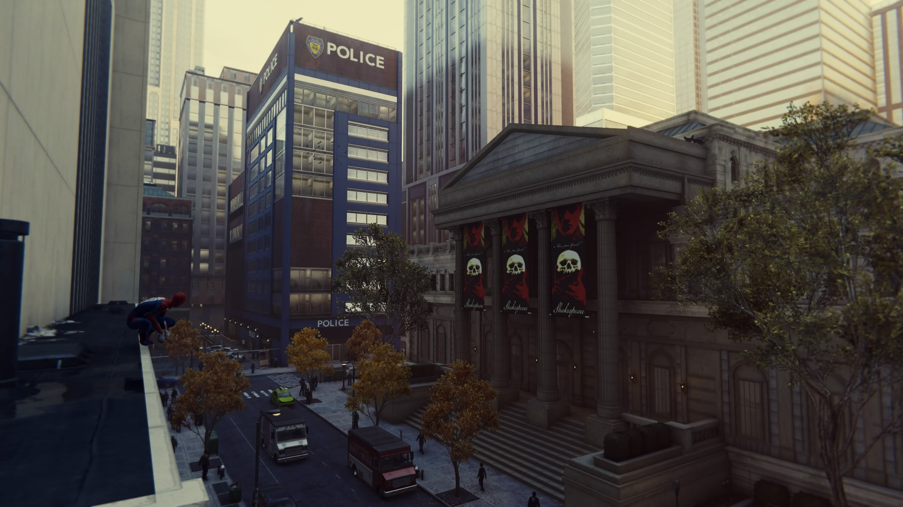
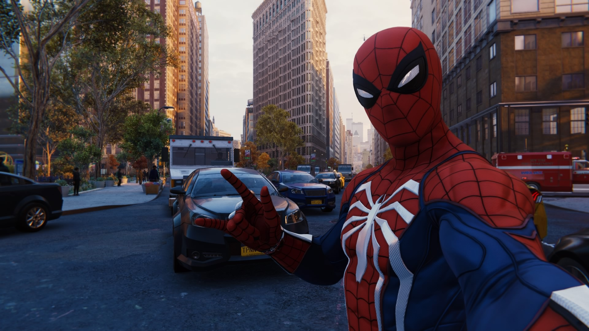
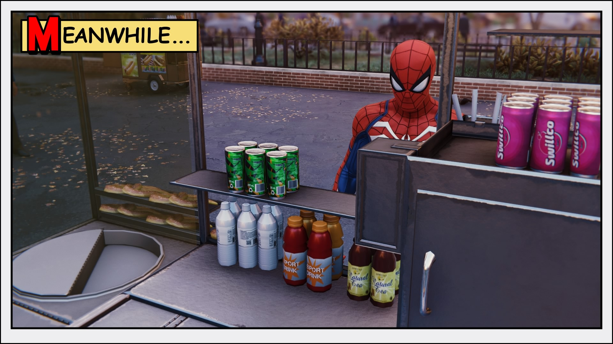
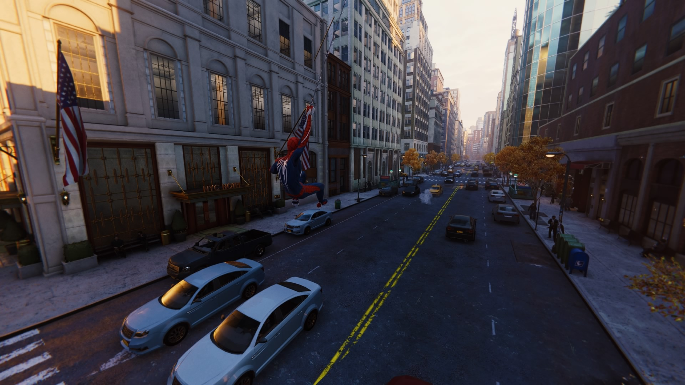

Game: *Marvel's Spider-Man* (PS4)

Time played: 5-ish hours

On a whim, I picked up *Marvel's Spider-Man* (PS4) after setting it down for over a year. Oh man, is it such a joy—far more than I had expected.

I was lent the game by a friend over a year ago—it must have been back in 2019, well before the pandemic. I had tried it out for a few hours, and while it wasn't a bad game by any means, I don't remember feeling particularly interested in committing to what it had to offer. It seemed like a pretty standard action-adventure game, with a sheen of Marvel polish and marketing on top.

Well, I booted it back up for no other reason than the fact that my current rotation of games—*Apex*, *Yakuza Kiwami*, and \*Dark Souls III—\*is pretty routine at this point. Despite jumping headfirst into a plot whose details I have little recollection of, I was pleasantly surprised by how joyful of a time I had swinging, punching, and web-shooting my way throughout Spidey's New York City.

## The part where I nerd out about the world's design because the world is New York City

Which leads me to this: for me, the most obvious surprise was the beauty of the in-game city. Familiar neighborhoods and landmarks throughout Manhattan are dutifully recreated.

You bet your ass I swung straight to Chinatown to breathe in the fake game air of the neighborhood I love so much. Of course, it's not a one-to-one recreation, but even just seeing the buildings and signs brought me back to the reverence I have for its real-world counterpart.

I also opted to put down my web slinger and stroll around Union Square and Washington Square Park, as a regular, non-superhero denizen would. The world is obviously optimized for breadth over depth, as most open worlds are, yet I still admired how faithful it was to the real city—to the point where I often found myself using my own knowledge of the streets to find famous landmarks such as the New York Library (the game's version of the NYPL).

> *The world is obviously optimized for breadth over depth, as most open worlds are, yet I still admired how faithful it was to the real city...*

While we're on the topic of *Spider-Man*'s NYC, god, I wish some parts of it were real. There's so many elevated streets, a la High Line, where you have open plaza-like areas floating over traffic. There's also a lot more open space in general, which I personally love, and think Manhattan lacks. Another thing: any Robert Moses critic would moan ecstatically about how much open walking space there is. Manhattan notably has nearly no alleyways, so it was a little bittersweet seeing so much open walking space between the in-game streets.

## Fighting crime, biding time

OK, but what about the game? The combat is something juicy, I'll say. I haven't fully gotten the hang of it yet...but when it works, god damn it works. Chaining actions into one another feels so smooth, like a seamless movie or a choreographed sequence. Whereas *The Last of Us: Part II* is a master class in smooth combat from a close-up, hand-to-hand POV, *Spider-Man* is a fast-paced, think-quick, explosive treat.

Nevertheless, 3 or so hours *in medias res*, the combat is real tough. Spidey-like reflexes are required to handle nearly a dozen enemies at a time. When I'm not button-mashing to survive, I'm enjoying the intense sense required to take down one foe, while keeping track of another aiming their gun at me, while preparing to dodge an oncoming swing of an electro-axe.

> Whereas The Last of Us: Part II is a master class in smooth combat from a close-up, hand-t*o-hand POV, Spider-Man is a fast-paced, think-quick, explosive treat.*

## Playable comic books

My brief glimpse into the world of Peter Parker and co. was a large source of joy. Spider-Man's dialogue throughout battles, with friends, and even when examining incidental items is as down-to-earth as it gets. His chipper attitude is backed by a great supporting cast, including M.J., Yuri, and J. Jonah Jameson. I obviously don't know these characters too well, but my first impressions are that I understand why everyone likes this guy—he's a homely New Yorker, just like the rest of us.

I really like the choice to set the game in Peter and M.J.'s adulthood, after they've graduated from college. There aren't many games or media that tackle with this period of young adulthood during or after college, so it helped me feel a bit personally closer to the characters. Even though the game stands on its own, you can tell that there's a ton of history and growth that these kids have gone through, and it shows their depth beautifully.

## Are we on board the Spidey train?

I plan to continue playing the game a bit more over the next few weeks, albeit incrementally. I tend to "break into" open worlds, like those of *Mirror's Edge: Catalyst* and *Yakuza 0*, delaying my dive into the main story. Oftentimes that's happened to a fault, as these worlds, I've found, rarely have open secrets on their own, independent from the interactions of characters and story developments.

I very much see that happening for *Spider-Man*, especially because it's in New York F*cking City. That's why I think it would be a good idea to dive right into the main story, and leave the extras as second, rather than first priorities, to forestall the taste of the plot.

I'm really excited to see what the game has in store—so far, it's full of charm and heart and AAA goodness, and more than I had initially given it credit for!

