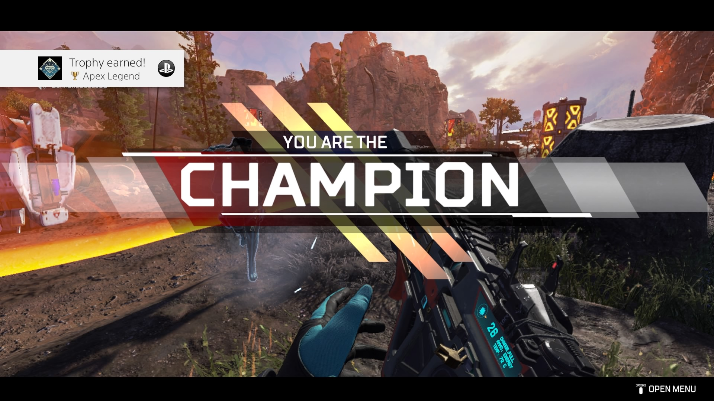

I was always the kind of gamer who would play at most five games a year and spend hundreds of hours playing each. In 2021, I made a concerted effort to expand my horizons and try out a broad range of games. If I had to assign this year a theme, it would be “seeing what the hype is all about”, as I finally got to visit classics from the legendary The Legend of Zelda: Ocarina of Time to the modern Dark Souls: Remastered.

# Top 10 games of 2021

## 10. Deltarune Chapter 2

*PC, 2021*

I’m happy to say that the long-awaited continuation to Undertale’s surprise sequel is a hit! This charming, 4-hour adventure game neatly serves Undertale’s signature dish of a wholesome romp with dashes of psychological horror elements.

In the three years since Chapter 1, Toby Fox has found a team to help advance his vision of the game, and it shows: the gameplay, music, graphics, and writing have all seen an iterative upgrade. While the story is mostly filler to build up for the next few episodes, it sets up many more mysteries that I’m invested in compared to Chapter 1.

## 9. The Forgotten City

*PS4, 2021*

Behold: the only 2021 release that I paid for and ended up playing. The Forgotten City is a time-traveling murder mystery in Ancient Rome, based on the Skyrim mod of the same name. The sandbox-style setup, coupled with a wide cast of characters and choices, make it a very compelling story to follow from start to finish.

It is an ambitious game, almost to a fault—much of the initial mystery is more interesting than the actual payoff. That said, it sets up expectations and consequences super well in a way that I haven’t seen in games before, and it makes me really excited for the future of narrative-driven games.

## 8. Apex Legends

*PS4, 2018*

In 2021, I invested a lot of time in activities with high ceilings for self-improvement, including guitar, running, and chess. Out of all of these, I probably spent the most time by far at Apex Legends. Whether this sci-fi battle royale is a truly skill-based game is up for debate, but in my time grinding ranked, I’ve definitely tasted the addiction to the process of gettin’ gud.

It’s truly polarizing—there are just as many, if not more, days where I get frustrated as there are when I feel good enough. One thing I can’t deny is that Respawn has set a high standard for the FPS genre, and Apex has got a ton going for it, particularly its deep emphasis on team strategy.

## 7. Hades

*Switch, 2018*

I only played Hades for a bit at the beginning of the year, but man, it was my gaming life for a few weeks. As far as my first roguelike experience goes, I’m pretty satisfied with it. The gameplay loop of hunting for boons and desperately fighting against hordes of enemies is quite satisfying, if quite tough for a newbie to the genre.

I also quite liked the story and cast of characters. Many laud Hades for how it takes storytelling to the next level by creating fully voiced contextual dialogue for *every single run*, and I think this not only sets a really wonderful precedent for immersive storytelling in the future, it shows how it’s possible in indie games well outside of the AAA sphere.

## 6. Super Metroid

*Switch, 1994*

I’m happy to say that I can finally say where everyone’s coming from when they endlessly praise Super Metroid as one of gaming’s GOATs. Much of my experience was filtered through trying the original Metroid a couple times and not really seeing a reason to go very far. Super Metroid takes the game to a whole other level, in a way that just wasn’t possible on the NES, and it delivers a satisfying, atmospheric adventure.

While the creepy atmosphere and general design hold up very well (I’m particularly impressed at how the music was so unsettling in an age of cheery Mario chiptunes), much of the gameplay, particularly boss fights, was prone to being horribly frustrating. I also wish there was a little more to go off of story-wise—narratively, Super Metroid is barebones. I’m excited to see how Dread builds on this game, both from a story and gameplay perspective.

## 5. The Legend of Zelda: Ocarina of Time 3D

*3DS, 2011*

Another classic on this list, I’m pleasantly surprised at how well Ocarina of Time holds up. Although much of that could be chalked up to the timelessness of the original game’s design, the 3DS remake serves as the Sparknotes to this Shakespearean play. It’s incredible to see how much this game was able to do in 1998, when 3D games were in their infancy.

Like Super Metroid, some of the game design is dated, but fortunately there’s rarely a moment where it felt like the challenge was downright unfair. Aside from the standard Zelda sword-slashing and dungeon-crawling gameplay, there’s a really beautiful world and story underneath it all, in ways that are so timeless and astonishingly powerful even compared to today’s games.

## 4. Dark Souls Remastered

*PS4, 2018*

A classic for a different reason, Dark Souls Remastered was a tremendous test of patience, but also incredibly rewarding. The highs go to the sky and the lows fall to the depths. I crumbled in fear, descended upon Undead enemies with pure hatred, resigned from monstrous boss fights in frustration, and marveled at environments in awe. The mysterious, yet incredibly subdued story further added to the journey’s tension.

My favorite part is the sprawling post-apocalyptic medieval world, and my least favorite part is the clunky controls that sometimes leave me feeling powerless. I almost wish people could experience traversing this treacherous, yet stunning world without having to commit to the grind of becoming strong enough to overcome its enemies.

## 3. Persona 5

*PS4, 2017*

This one is unique because I had beaten 90% of Persona 5 in 2018, put it down for four years, and randomly decided to finish it in the last week of the 2021. When I picked it back up, I was immediately reminded how fantastic this game is. The unparalleled rebel-themed art direction, beautiful Tokyo setting, and lovable cast of characters makes it an experience that means a lot to me personally. And did I mention one of the greatest soundtracks of all time?

It’s not a perfect game by any measure, not even by any of the standards I just listed. I’ve listed it at 3 because I think that it’s ultimately worth more than the sum of its parts. But Persona’s charm, character, vibe, style—call it what you will—is truly one of a kind, and hard to forget.

## 2. Dark Souls III

*PS4, 2016*

Dark Souls III is like playing a movie. It’s devastatingly beautiful in a way that few other games of this generation are. The controls have gone from feeling cumbersome to fluid and responsive. The adventure, no less deadly, is just as frightening, frustrating, and rewarding as it is in Dark Souls. The story, although still opaque, provides a little more intrigue.

My only complaint is that the levels are far more linear than the original Dark Souls. Exploration feels just as wonderful, but the world does feel somewhat tighter and more constrained. None of that should detract from what is otherwise a certified blast.

## 1. Yakuza 0

*PS4, 2015*

Out of all of the games on this list, Yakuza 0 is one of the biggest surprises. It’s got a beautiful and lively open world in Kamurocho, a gritty but lively red-light district in 1980s Tokyo. I spent my first 5-10 hours of gameplay simply walking around, trying to appreciate the environment.

But once I started following the actual main quest and side quests, everything changed. The characters **make** this game. You can go from wacky side quests featuring personalities such as masochists and cult recruits to dramatic and violent main quests in the span of minutes. Fantastic writing, a vivid world, and hilarious characters makes this game a total banger, and my top game of 2021.

# Bonus: Games I’m excited to play in 2022

* **Elden Ring**: To be frank, I haven’t been following this game much at all. It might just be the tsunamis of hype in the gaming world that are catching up with me. As a new fan of the Dark Souls genre, I’m excited to see how this open-world entry breaks new ground. My only concern is that PS4 performance is going to be subpar.
* **Sequel to The Legend of Zelda: Breath of the Wild**: I really don’t know what to expect here, mainly because we’ve seen a collective three minutes of footage over the last three years. I’m really interested to see how it will set itself apart from BOTW—after all, how do you iterate on a revolutionary idea?
* **Persona 5 Royal**: Since finishing Persona 5, I’ve been on a Persona 5 binge. Royal is the updated edition of the original with a litany of new features and story elements, and I’m really excited not just to discover those, but to experience Persona 5 once again since starting it four years ago.
* **Persona 5 Strikers**: I picked up this direct sequel to Persona 5 on Playstation Plus, and god damn, is it a delight. The gameplay is more Dynasty Warriors than Shin Megami Tensei, yet it’s integrated within the Persona 5 universe so naturally that it almost feels more appropriate than the standard JRPG battles. More than a worthy follow-up, and I’m stoked to play more.
* **Metroid Dread**: Had the misfortune of having broken Joy-Con controllers when I picked this game up at release. Given the immense praise that’s come out, I can’t wait to jump in and see what the hype is all about.
* **Deltarune**: The last chapter left a lot of questions that I want to see answered, from the main character arcs to some more insidious themes lurking beneath the main plot. I’m anticipating a late 2022 release for chapters 3-5.
* **God of War (2018)**: I’m only a few hours into this game, and not exactly blown away just yet, so I’m curious as to why people consider this to be one of the defining games of the last generation. It sure is beautiful, and gameplay does remind me of The Last of Us: Part II.
* **NEO: The World Ends With You**: A sequel to a game that influenced me deeply as a teenager, I’m really looking forward to seeing how this builds off of the original’s charm and story.
* **Dragon Quest XI: Echoes of an Elusive Age S—Definitive Edition**: Another game that has been really hyped up for me. I can’t say I know too much about what to expect aside from playing the first hour or so in the demo, but I’m incredibly excited, especially because I know it’ll be a huge journey to sink my teeth into.

# Photo credits

Deltarune screenshot: Destructoid

The Forgotten City screenshot: Modern Storyteller, Steam

Hades screenshot: Nintendo, Supergiant Games

Super Metroid screenshot: Nintendo