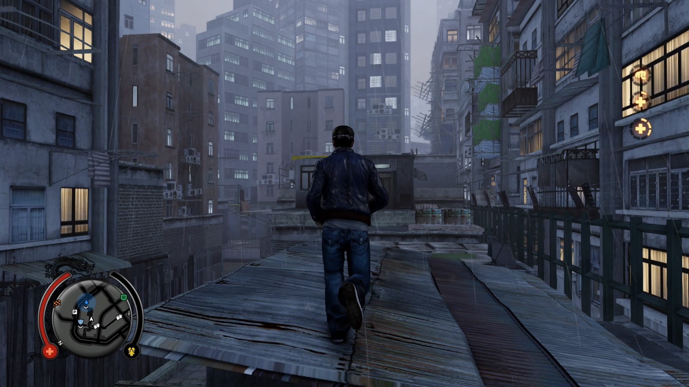
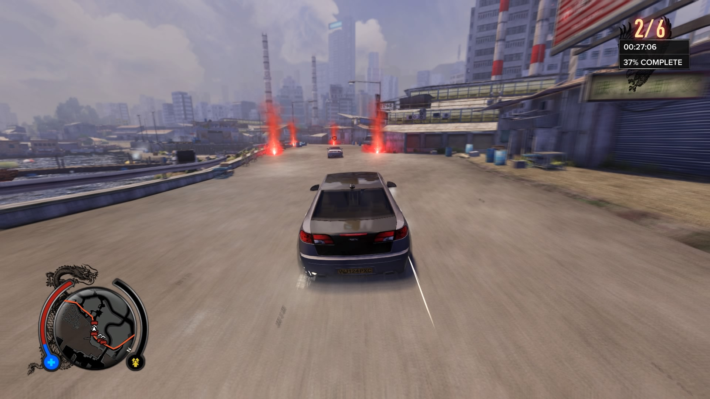
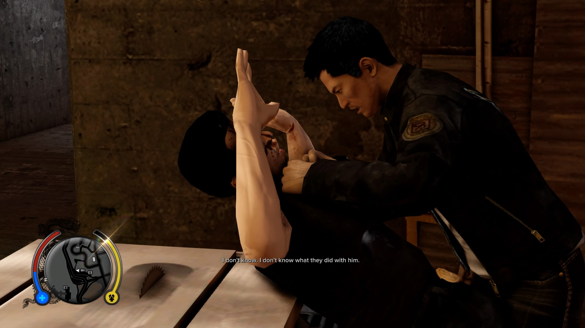
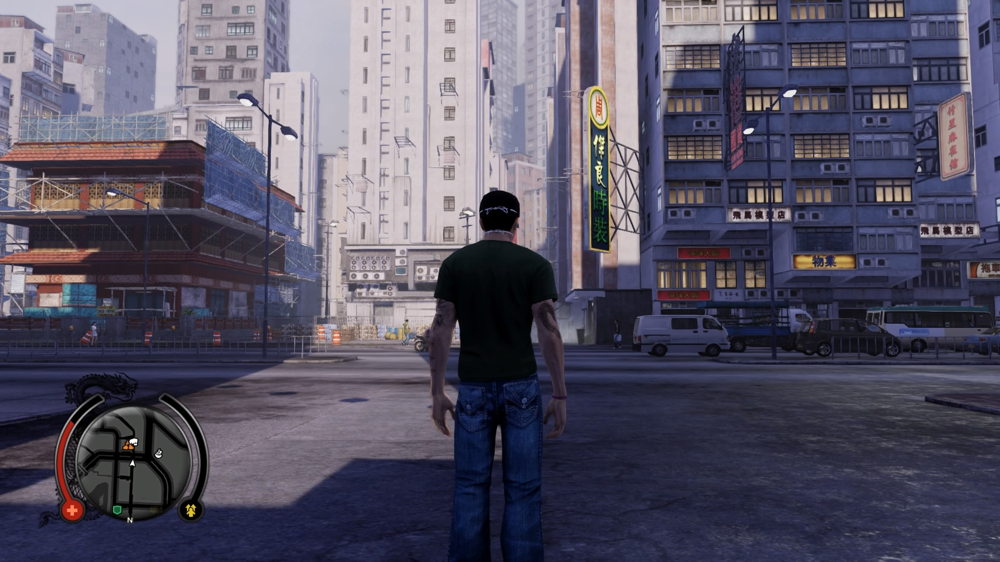
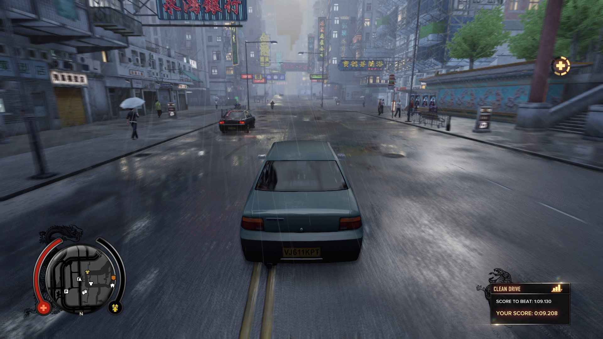
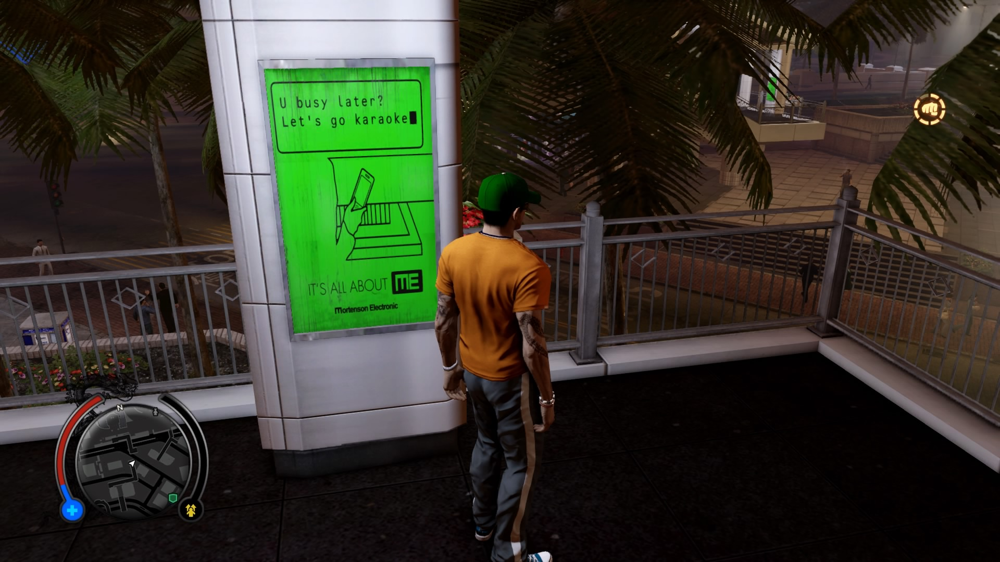
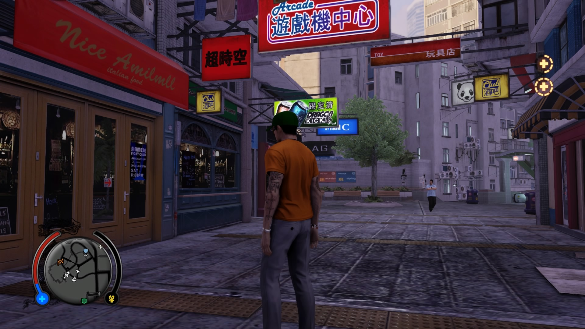

> *let sleeping dogs lie*:\
> to ignore a problem because trying to deal with it could cause an even more difficult situation \
> — Merriam-Webster

I’m not quite sure what are the “dogs” that Sleeping Dogs’ title refers to, but having finished the main story, I know for sure that the game tiptoes over a pack of hungry dogs of its own. What could have been a fascinating exploration of several topics—identity, belonging, strength, among others—opts instead for a flashy, explosive, and bloody car chase that indecisively hovers between the dramatic and campy.

I’ll start with my favorite part: driving down the highway to get to the next mission. Coasting down Hong Kong’s roads, taking in the city sights, and blasting pop tunes on the radio is a great vibe. Indeed, traveling through the game’s rendition of Hong Kong is a delight, if only for the reason that it’s so atmospheric, from the working-class night market in North Point to the upper-class, business-suit-clad commercial districts of Central. I cherished the opportunity to drink in this home that I’ve never known—an abbreviated, exaggerated home, sure, but a representation of a home that I was nonetheless drawn to.

But once I exit my car, there’s not much to praise among the people of Hong Kong. The bulk of the character interactions outside of the main story consist of zero-to-low-stakes favors for unlikeable triads, seedy shopkeepers, or tragically one-dimensional party girls. Compared to Yakuza (a comparison I invoke cautiously, for I know that each game aims for very different things), which goes all-out in celebrating its colorful cast of side characters, Sleeping Dogs’ denizens love to remind you that you’re a trashy gangster doing trashy favors for trashy people.

Still, it’s nothing unexpected for a GTA clone from 2012. What about the story? Well, it’s a bit of a mess. Sleeping Dogs doesn’t quite deliver on the promise that makes it truly unique—the opportunity to tell a story unique to Hong Kong, and the people who live there.

From an execution standpoint, the mission design is rock-solid GTA clone at best, campy B-movie on the averages, and insultingly lazy at worst. It was nigh impossible to follow along with the plot, because the game gives approximately one dust speck’s worth of context for each mission. Who the hell is Sonny Wo, and why do I have to meet him again? Better wait for the arbitrarily timed exposition dump three missions later.

The delightful experience of playing through a checklist of non sequiturs is, however, most obvious in each mission’s objective-to-objective gameplay. For example, it loves to wrap up missions by playing a generic 2-second cutscene of cop cars driving with a character yelling “oh shit we gotta run from the cops!” It was tolerable B-movie camp at first that was eventually repeated so often that I could see the faint imprint marks of a cookie cutter template.

Thus, my main criticism: the protagonist, Wei Shen. From the outset, Wei poses many intriguing questions about identity. For one, he’s a cop with a strong sense of duty—what’s up with his unsettling attachment to “belonging” in the Hong Kong triad? Why return to HK from the states? What allows him to kill for these guys without a second thought?

Unfortunately, Sleeping Dogs rarely explores, let alone resolves, these questions of his complicated identity or his motives. There’s a ton of cool opportunities to analyze his fluctuating, often conflicted identity—violent triad and grizzled cop, Hong Konger and Asian American, justice, masculinity, home... Instead, SD answers all problems with gratuitous violence, car chases, and spectacular setpieces, as if to hide its timidity toward these difficult questions.

I admit that I was excited to play this game for the better part of ten years because I, like Wei, am the child of Chinese immigrants from Hong Kong. I know how it feels to search for a place I can call home, and to look longingly toward the birthplace of my family for answers. By the time I finished Sleeping Dogs’ last mission, I was more than ready to leave it and move on—perhaps I’ll find some answers elsewhere.

* **Score**: 6/10
* **Time to beat**: 24 hours
* **Platform**: PS4

## Extra thoughts

* I didn't talk much about the actual gameplay in the review. It's nothing spectacular, honestly. Driving is hands-down one of the most fun parts, especially being able to experience the city and zoom around. On-foot movement is a little clunky, even with on-screen prompts that allow smooth parkour moves over obstacles. Combat is fairly one-note; the upgrade trees are cool and come with a neat side quest involving Wei's old kung fu master. But the counter system is inexplicably clumsy. I also expected the use of environmental attacks would be more common. Overall, it's largely a one-button affair that gets old by the end. Oh, and gun combat feels terrible for how frequently it happens.
* For a PS4 remaster of a PS3 game, the performance, is, frankly, shit. The most egregious issue is the framerate, which is capped at 30fps and often dips down, especially in high action sequences.
* I discovered that Uncle Po, the triad leader, was voiced by James Hong, a legend in American film who I discovered through *Everything Everywhere All At Once*. I have a newfound respect for that character…perhaps the only thing I respect about that character.
* The radio is genuinely very good. I’m very impressed at the songs they were able to license, from Queen to Cantonese pop and hip-hop.
* I was hoping up to pick up a bit of Cantonese through this game. Unfortunately, there isn’t much to pick up aside from “fuck you 屌你老母” and “go die 仆街” yelled by drivers.

