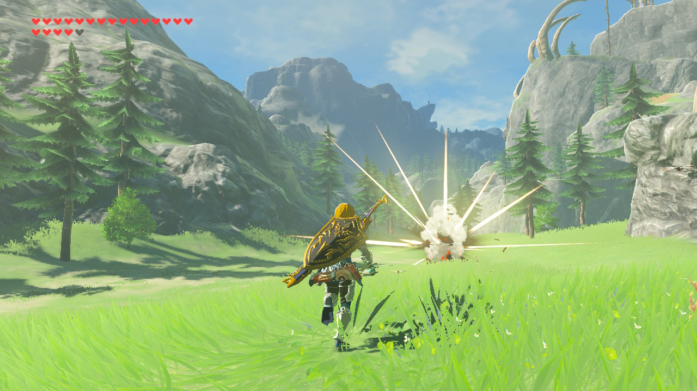

One of my favorite things to do on a summer afternoon is to set off on a bike ride around town. It's a relatively recent hobby, having spent the better part of my adolescence hiding away in my room in front of my computer. Even having grown up here all my life, I still find joy in discovering new places and sights.

Perhaps this love for exploration is why I want to I love The Legend of Zelda: Breath of the Wild (Nintendo, 2017) so much. Over the span of two years, I've clocked in almost 200 hours romping around post-calamity Hyrule.

There's a fundamental difference in how I experience exploration in BOTW and real life, however. In real life, I find exploring to be extremely rewarding in its own right. In BOTW, I find exploring to be a passable way to pass time—aside from seeing the occasional screenshot-worthy landscape, I find little intrinsic enjoyment from sifting through Hyrule's vast world.

Here, I want to jot down some of observations comparing and contrasting the way I experience exploration IRL vs. how I experience it playing BOTW. These are more so unpolished observations than well-formed thoughts because I'm still trying to figure them out.

Hopefully in the future I'll have formed these observations into a well-constructed opinion about what BOTW gets right and wrong about exploration, and I'll publish that here.

## Picturesque views

One reason I find myself coming back to BOTW so much is because it's simply a beautiful game. Nintendo certainly didn't skimp on creating a convincingly untamed world, and just as with Horizon Zero Dawn (Guerrilla Games, 2017), I find myself taking screenshots every few minutes of the jaw-dropping sights.

Today, I played for around an hour, making my way to Zora's Domain for the first time in at least several dozens of hours of gameplay. Holy crap, that place is gorgeous! The sense of scale crossing under the looming cliffs and over the rushing water is something I can only hope to experience in person.

")

I suppose that if we were to judge the value of exploring purely based on the quality and quantity of photos taken, BOTW would edge out any expedition I've had IRL.

While playing, I also realized that this behavior actually mirrors how I explore new places in real life. I love going on little "adventures," whether around my home town or on vacation, and drinking in new environments. And although I don't carry around cameras like I used to, I'll still often feel an itch to capture photos of these moments and sights to remember them by.

## The intrinsic rewards of "filling the map"

One of the most common praises for this game is the sense of awe from being able to go literally anywhere you want in the map. See a mountain? You can climb all the way to its top. See a river? You can swim across its entire length. That threatening-looking valley? You can stroll right in!

For an exploration junkie like me, I would theoretically love this. But where BOTW falters for me is that I don't feel a sense of joy or entertainment from breaking off the main path and seeing for myself what's beyond. It's as though the sense of scale and mystery from seeing the world beyond the main paths is more awesome than the actual experience of taking things into my own hands and charting over the world.

I'm not quite sure yet why combing through the nooks and crannies of Hyrule doesn't do it for me. It's definitely not a unique sentiment either. I've heard some chalk it up to the world feeling "empty" due to the sparseness of interesting NPCs and towns. 

### The stories of the land

Although there could be many factors, I'll isolate lore as one potential reason as to why BOTW feels underwhelming to explore at times. I'll compare it to Dark Souls Remastered (FromSoftware, 2018), a game whose world I absolutely LOVED exploring.

In Dark Souls, I had so many questions while traveling through the Undead Burg, all coming from little details such as the boss fights, the found loot, and best of all, the architecture of the walled city. On the other hand, in BOTW, I explored the Military Training Camp just south of Death Mountain. Not only did I learn pretty much nothing, I wondered about pretty much nothing. There's definitely visual hints to be found in the destroyed architecture of the area, but aside from that and the name of the place, the game offers no reasons to care about it.

In Dark Souls, a game that tells the player far less than it shows, every area comes with a rich but mysterious story to discover. In BOTW, there are vague glimpses that said stories might have existed, but they're far too simple or vague or just nonexistent, and so the pretty sights unfortunately end up being more surface-level eye candy than the ruins of a once-thriving civilization.

### Finding joy in the city

The only issue I have with that theory is that while it might make sense on a game design level, it's a different story with my own IRL experiences. Riding my bike around town just to see the sights certainly feels a lot deeper and satisfying than the video game alternative. In the real world, exploration feels like its own reward. In BOTW, it feels like it needs a justification, which it lacks.

At least while riding around town, I genuinely feel a bit of joy, curiosity, and satisfaction from, to use gamer parlance, "filling the map." I like getting a tiny glimpse in how people live, based on the housing, infrastructure, and people walking around. 

The aesthetic sights of an average suburban town, although incomparable in grandeur to the landscapes of BOTW, are still present and spark joy, albeit in little bits and pieces. I always stop to take in a warm sunset when I can, and in the spring, the sight of petals floating around in the wind is always refreshing.

Thinking about it now, maybe it is partially a sensory thing; after all, video games (as of now) can only do so much to replicate the filling experience of being a human in the outdoors. I also am guilty of playing all 200 hours of BOTW on the tiny Switch screen, having no access to a TV to play on. But to the contrary, surely that's an intended way to play the game, right? Otherwise Nintendo wouldn't have made the Switch a handheld device in the first place.

## Conclusion

There isn't much to conclude, other than what has already been said at the start: exploring in BOTW seems unfulfilling and empty. It should be rewarding on first glance, because of the promise of a vast, open, beautiful world, but when I look to be impressed by something beyond the pretty landscapes, I honestly don't find too much.

Still, I'm determined to get at the heart of why this is the case. As someone who loves exploring my town (and any other unfamiliar places I set foot in), I feel a sense of curiosity and excitement just from being there. So my questions that I'd like to seek out answers for are:

1. What makes exploration fun?
2. To what extent is exploring fun in Breath of the Wild?
3. How does exploring in video games differ from exploring in real life?